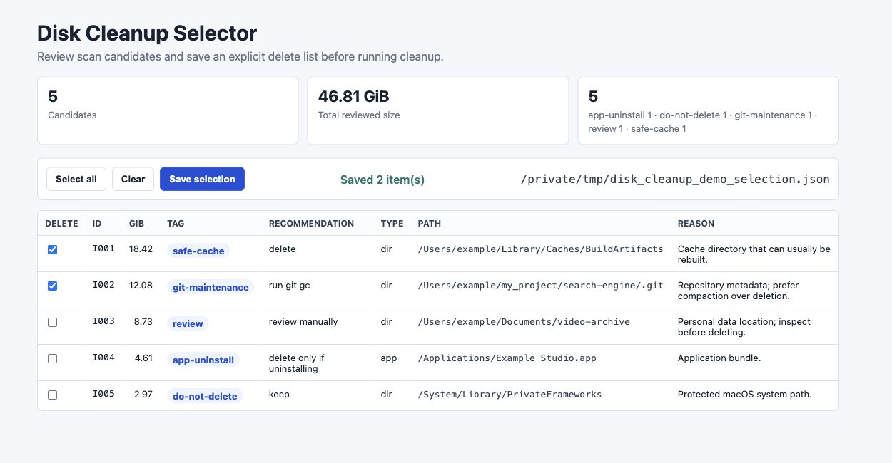
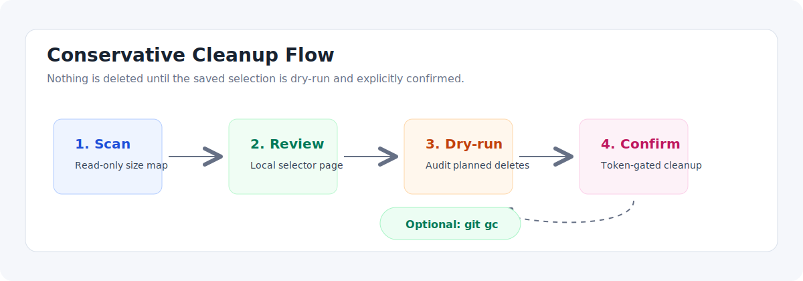
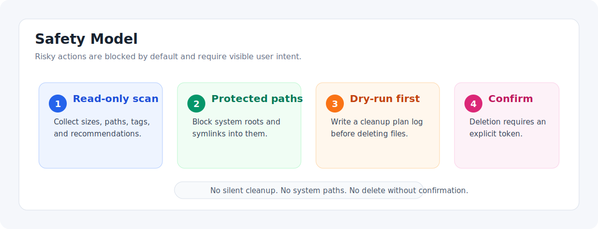

# Disk Cleanup Assistant

<p align="right">
  <a href="./README.md">English</a> | 简体中文
</p>

Disk Cleanup Assistant 是一个通用的 Mac 磁盘清理工具集，支持大文件/大目录扫描、交互式删除选择、安全执行清理，以及对项目目录执行 `git gc`。

它适合处理 “System Data 很大”、“Documents 很大”、“不知道哪些目录能删” 这类场景。整个流程会尽量保持可审计：先扫描，再在本地页面里逐项选择，随后 dry-run，最后只有显式传入确认 token 才会删除。



## 功能

- 按指定根目录、扫描深度和大小阈值找出大文件/大目录。
- 自动给候选项打标签：缓存、需人工确认的数据、应用卸载、git 维护、系统保护路径。
- 输出 Markdown 报告和 JSON 候选列表。
- 启动本地网页，用于勾选“删 / 不删”。
- 删除前支持 dry-run，并记录执行日志。
- 真正删除前强制要求 `--confirm-delete DELETE_SELECTED_PATHS`。
- 阻止删除 macOS 系统路径，以及指向系统路径的符号链接。
- 可选对项目目录批量执行 `git gc --prune=now`。

## 工作流



## 安全机制



这个工具集默认保守。

- 扫描只读。
- 选择页面只保存选择，不执行删除。
- 未传确认 token 时，清理脚本会直接阻断。
- `/`、`/System`、`/Library`、`/usr`、`/bin`、`/sbin` 及其子路径会被保护。
- `Documents`、`Desktop`、`Downloads`、浏览器 profile、照片库、邮件、应用数据等默认需要人工确认。
- 运行中的应用可能会重建空的缓存/日志目录，因此最终判断应看目录大小，而不是只看路径是否存在。

## 快速开始

在仓库根目录执行下面的命令。

### 1. 扫描大文件/大目录

```bash
python3 scripts/scan_large_items.py \
  --threshold-gb 1 \
  --depth 5 \
  --output /tmp/disk_cleanup_candidates.json \
  --markdown /tmp/disk_cleanup_candidates.md
```

需要限制扫描范围时，可以指定根目录：

```bash
python3 scripts/scan_large_items.py \
  --roots "$HOME/Library/Caches" "$HOME/my_project" "$HOME/go" \
  --threshold-gb 1 \
  --depth 5 \
  --output /tmp/disk_cleanup_candidates.json \
  --markdown /tmp/disk_cleanup_candidates.md
```

### 2. 打开选择页面

```bash
python3 scripts/selector_server.py \
  --candidates /tmp/disk_cleanup_candidates.json \
  --selection /tmp/disk_cleanup_selection.json \
  --port 8765
```

然后打开：

```text
http://127.0.0.1:8765/
```

只勾选你确认要删除的项目，然后保存选择。

### 3. 先 dry-run

```bash
python3 scripts/apply_selection.py \
  --candidates /tmp/disk_cleanup_candidates.json \
  --selection /tmp/disk_cleanup_selection.json \
  --log /tmp/disk_cleanup_apply_dry_run.json \
  --dry-run
```

### 4. 确认执行

```bash
python3 scripts/apply_selection.py \
  --candidates /tmp/disk_cleanup_candidates.json \
  --selection /tmp/disk_cleanup_selection.json \
  --log /tmp/disk_cleanup_apply_log.json \
  --git-gc-root "$HOME/my_project" \
  --confirm-delete DELETE_SELECTED_PATHS
```

只有需要做仓库维护时才传 `--git-gc-root`；如果只是按选择删除，可以省略它。

## Go Module Cache 说明

Go 工具和 IDE 可能会在清理过程中重建或占用 `~/go/pkg/mod/cache/vcs`。如果你已经确认要清理 `~/go/pkg/mod`，并且活跃的 `go`、`git`、`ssh` 子进程只是缓存重建进程，可以这样执行：

```bash
python3 scripts/apply_selection.py \
  --candidates /tmp/disk_cleanup_candidates.json \
  --selection /tmp/disk_cleanup_selection.json \
  --log /tmp/disk_cleanup_apply_log.json \
  --confirm-delete DELETE_SELECTED_PATHS \
  --kill-go-cache-users
```

这个参数要谨慎使用。它只会终止 `lsof` 识别出的缓存相关 `go`、`git`、`ssh` 子进程。

## 候选项标签

| 标签 | 含义 |
| --- | --- |
| `safe-cache` | 缓存或构建产物，通常可以重建。 |
| `review` | 用户数据或应用数据，需要人工确认。 |
| `app-uninstall` | 应用包；只有想卸载应用时才删除。 |
| `git-maintenance` | 仓库元数据；优先用 `git gc`，不要直接删 `.git`。 |
| `do-not-delete` | 系统路径或受保护路径。 |

## 测试

```bash
python3 -B -m unittest discover -s tests -v
```

测试只使用临时目录和 dry-run 路径。

## 仓库结构

```text
.
├── LICENSE
├── README.md
├── README.zh-CN.md
├── SKILL.md
├── agents/
│   └── openai.yaml
├── docs/
│   └── images/
├── scripts/
│   ├── apply_selection.py
│   ├── scan_large_items.py
│   └── selector_server.py
└── tests/
    └── test_disk_cleanup_safety.py
```

## License

MIT.
